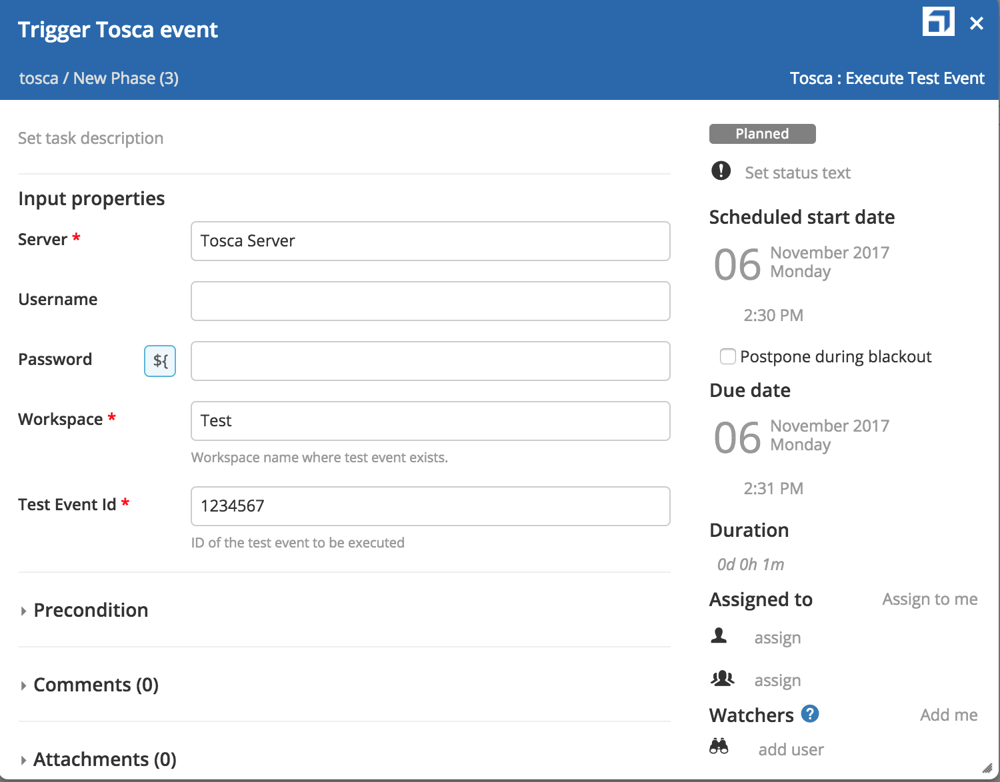

# XL Release TOSCA plugin

This plugin offers an interface from XL Release to Tricentis TOSCA for executing automation test cases. 

## CI status ##

[![Build Status][xlr-tosca-plugin-travis-image]][xlr-tosca-plugin-travis-url]
[![Codacy Badge][xlr-tosca-plugin-codacy-image] ][xlr-tosca-plugin-codacy-url]
[![Code Climate][xlr-tosca-plugin-code-climate-image] ][xlr-tosca-plugin-code-climate-url]
[![License: MIT][xlr-tosca-plugin-license-image]][xlr-tosca-plugin-license-url]
![Github All Releases][xlr-tosca-plugin-downloads-image]

[xlr-tosca-plugin-travis-image]: https://travis-ci.org/xebialabs-community/xlr-tosca-plugin.svg?branch=master
[xlr-tosca-plugin-travis-url]: https://travis-ci.org/xebialabs-community/xlr-tosca-plugin
[xlr-tosca-plugin-codacy-image]: https://api.codacy.com/project/badge/Grade/b11c699b6164409a93e9cfc8ee318016
[xlr-tosca-plugin-codacy-url]: https://www.codacy.com/app/joris-dewinne/xlr-tosca-plugin
[xlr-tosca-plugin-code-climate-image]: https://codeclimate.com/github/xebialabs-community/xlr-tosca-plugin/badges/gpa.svg
[xlr-tosca-plugin-code-climate-url]: https://codeclimate.com/github/xebialabs-community/xlr-tosca-plugin
[xlr-tosca-plugin-license-image]: https://img.shields.io/badge/License-MIT-yellow.svg
[xlr-tosca-plugin-license-url]: https://opensource.org/licenses/MIT
[xlr-tosca-plugin-downloads-image]: https://img.shields.io/github/downloads/xebialabs-community/xlr-tosca-plugin/total.svg

## Installation ##
+ The plugin https://github.com/xebialabs-community/xlr-tosca-plugin/releases should be placed under `plugins`.
+ Compatible REST API version should be installed on Tosca server, check the docs https://tricentis.service-now.com/community/api.do

## Tricentis Tosca Testsuite
The following actions are supported:

### Trigger test event in Tosca workspace
Create task Execute test event to trigger a test event in Tosca. Add Tosca server in shared configuration and use it in task.
Mandatory fields are Tosca workspace and event Id.

